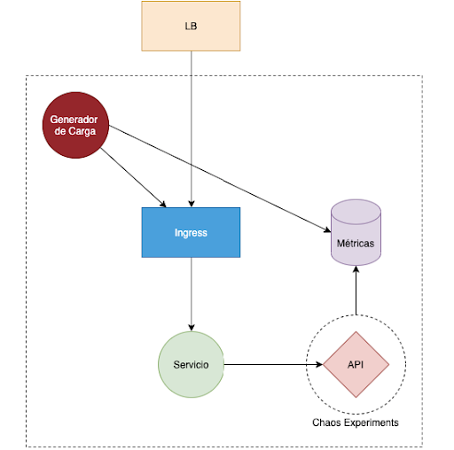
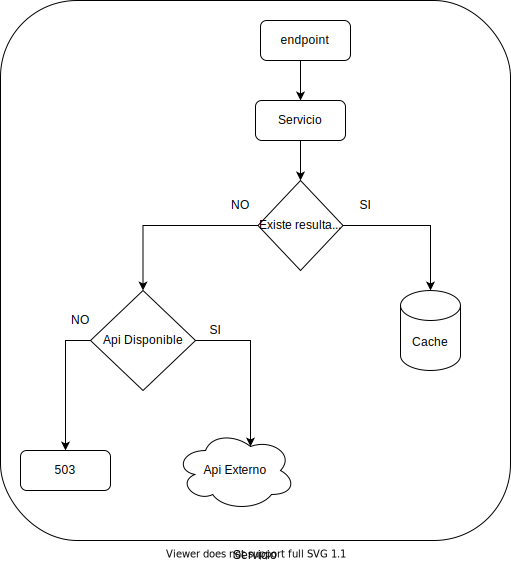

# Propuesta de solución para Hackathon Ceiba 2021

## Descripción de la solución

Para solucionar el problema planteado en la Hackathon se implementará un micro servicio en Golang, el cual expondra 2 endpoints de tipo
GET

`/healthz` -> Este se utilizara para saber el estado de la aplicacion, retornando el siguiente Json:

``` json
{
    "status": "ok"
}
```

`/?number={number}` -> Endpoint principal, el cual se utiliza para consumir un api externo, añadiendo estrategias de
Cache y de CircuitBreaker, este retronara el mismo objeto que retorne el api externo (ejemplo):

``` json
{
	"hostname": "node-app-744d54c8f7-8dmfz",
	"method": "GET",
	"url": "/?number=2",
	"data": "C",
	"date": "2021-11-12T18:32:09.531Z",
	"validitySeconds": 45,
	"token": "eyJ0eXaiO"
}
```

Para el segundo endpoint se implementara una estrategia de cachear las peticiones con un tiempo de vida igual a la
cantidad de segundos que vengan en la propiedad `validitySeconds`

## Drivers que orientan la toma de decisiones para la solución propuesta

* Disponibilidad: El servicio implementare un cache para las consultas, con el fin de responder las consultas lo mas
  pronto posible.

* Usabilidad: El servicio implementare circuit breaker para no tener a los usuarios esperando en caso de que ocurra un
  error con el api externo.

* Portabilidad: El servicio sera portable, dado que estara dockerizado ademas de ser un servicio a pequeña escala.

## Diagrama de solución

Basados en al arquitectura inicial:



Extenderemos la definicion de la implementacion del Servicio:



